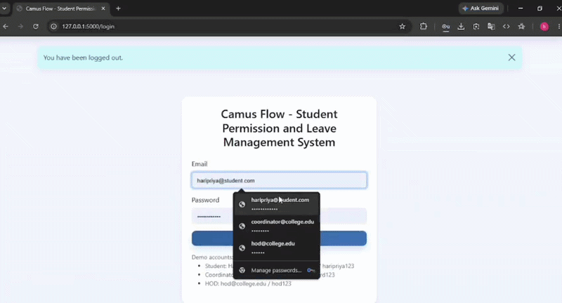

# Campus Flow - Student permissions & Leave Management System

A simple Flask project for Student permissions & college attendance leave approval. Students submit OD/medical leave requests, coordinators approve/reject them, HODs review final decisions, and attendance is updated automatically using the timetable, and any permissions for college activities can be done in minutes.

# Demo

A short demonstration of the complete workflow:

**Student → Coordinator → HOD Approval → Attendance Reconciliation**

[▶️ Watch Project Demo](https://drive.google.com/file/d/1rkMvLHo3x5VpnHMgFhfsjo_nrrIbBpP1/view?usp=drivesdk)



## [Drive link for FULL VIDEO ](https://drive.google.com/file/d/1rkMvLHo3x5VpnHMgFhfsjo_nrrIbBpP1/view?usp=drivesdk)


## Features

 # Camus Flow - Student Permission and Leave Management System

 ## Problem

 Student permissions and OD/medical leave requests are difficult to track when they use paper forms, messages, and separate records. Students may need to visit several people, while staff repeat data entry and students cannot easily see the request status.

 Department permission and OD leave are kept separate. Permission approval does not automatically change attendance; a student submits a separate OD request if attendance is affected.

 ## How I Found It

 I started by looking at a common college administrative workflow: how students obtain permission or leave approval and how that information reaches the department and attendance records.

I mapped the process from the student's request to coordinator review, HOD approval, and attendance handling. While breaking the process into individual steps, I identified several points where manual work could cause problems:

- Requests can pass through multiple people before being completed.
- Paper forms or messages can be misplaced or overlooked.
- Students may need to repeatedly ask for the status of a request.
- The same information may have to be recorded in more than one place.
- Approved OD requests may require a separate attendance correction.
- It may be difficult to identify whether a request is waiting with the coordinator or HOD.

Based on this workflow analysis, I chose OD and medical leave attendance reconciliation as the main problem and later extended the system to include department permissions.

This was a workflow-based analysis rather than a formal institutional study. I did not conduct interviews or collect personal student/staff data.

 ## Current Workflow

 1. The student submits an OD, medical leave, or permission form, sometimes with a document.
 2. The coordinator reviews it and sends approved requests to the HOD.
 3. The HOD makes the final decision.
 4. Approved OD/medical leave requests update attendance using timetable data.
 5. Students may still need to ask for status or remarks.

 ## Evidence

 **Measured:** The demo has student, coordinator, and HOD roles; separate records for users, attendance, timetable, leave, documents, and permissions; and 24 attendance test rows. Permission statuses are `Pending Coordinator`, `Pending HOD`, `Approved`, and `Rejected`.

 **Estimated:** A paper request may take 10 to 15 minutes to handle, plus 5 to 10 minutes for follow-up. These are planning estimates, not live measurements.

 **Assumed:** Staff can access the system during working hours, students provide usable details, and attendance and timetable records already exist.

 ## Operational Impact

 The current process can cause waiting time, staff effort, duplicate entry, incorrect dates or student IDs, delayed approvals, repeated follow-up, and poor visibility of remarks and request ownership.

 ## Proposed Future Workflow

 The student submits the request online. A department permission moves from `Pending Coordinator` to `Pending HOD`, then to `Approved` or `Rejected`. The coordinator and HOD add remarks, and the student can see the details, status, and approval history. Only an approved OD/medical leave request updates attendance.

 ## Where Automation Helps

 **Normal software and rules:** Login, role permissions, form validation, database storage, status changes, ownership checks, and timetable-based attendance updates.

 **AI:** OCR reads uploaded images or PDFs, and AI extraction can suggest names, dates, and organizations. These values still need checking.

 **Human judgment:** The coordinator and HOD make approval decisions and verify unclear documents, dates, and attendance impact.

 ## ROI / Impact Estimate

 Assumptions: 50 requests per month, 5 minutes saved per request, and staff time valued at 200 per hour.

 ```text
 50 x 5 minutes = 250 minutes saved per month
 250 / 60 = 4.17 hours per month
 4.17 x 200 = 834 estimated value per month
 834 x 12 = 10,008 estimated value per year
 ```

 This is only an estimate. Real request volume and handling time must be measured before using it for a budget decision.

 ## Risks

 OCR or AI may extract the wrong information. Unreadable documents, incorrect timetable data, wrong student IDs, password sharing, server failure, or delayed reviews could also cause problems. Stronger security would be needed before real deployment.

 ## Unknowns

 I could not verify the document error rate, actual savings. I also did not interview the real coordinator, HOD, or students.

 ## AI Usage

I used the OpenAI API (gpt-4o-mini) for OCR `for document processing` to `extract text and relevant details` such as names, dates, and organization information from uploaded documents.
